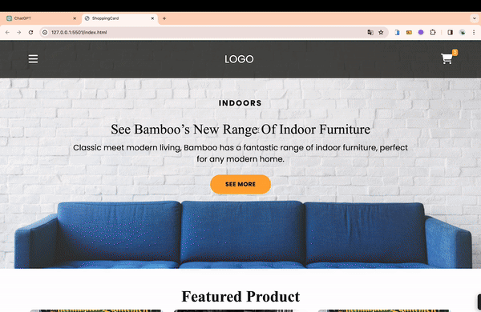

<h1> shoppingCard </h1>

In this project, the focus was on elevating visual aesthetics using CSS, Bootstrap library, and JavaScript. The implementation also includes dynamic functionality with data fetching via the Fetch API, and storage in LocalStorage.

<h2> The technologies used in the project </h2>

It was coded using Html, Css and JavaScript technologies.

<h2> Demo </h2>

You can view a live demo of this project [here]( https://seliinatmaca.github.io/shoppingCard/).

<h2> Screenshot </h2>

# shoppingCard

